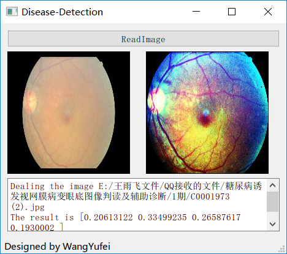

# Eye Disease identification
# 眼部疾病识别
这个是我大创的一个项目，诊断由糖尿病引发的眼部疾病。目前是用基本的CNN做的疾病分期，根据老师给的数据和Kaggle数据集合的一部分。其实可以用CAM网络做一个大概病灶位置的判断，但是自己犯懒不想做了。

## 实现
利用tensorflow+python3.5完成的，然后又用pyqt5加了一个简陋的界面。

## 目前的效果
界面如下

先自动对图像进行切割以及预处理，然后传入卷积神经网络，并输出结果。

## 说明
- deal.py是预处理图像用的
- train.py训练以及预测
- gui_main.py界面的逻辑部分

## 其他
水一水项目，见笑